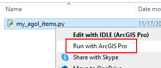

# my_agol
ArcGIS Online is a great tool. Downside? Our user accounts can get cluttered.

This simple Python script downloads a list of your ArcGIS Online content into a spreadsheet (my_agol_items.xlsx). The output spreadsheet lists your item's title, type (web maps, apps, uploaded shapefiles, etc.) file size, and the date it was last updated.

Credentials for accessing your content are stored in your ArcGIS Pro installation. If you don't have ArcGIS Pro installed, ask your managers and local tech support.

After downloading my_agol_items.py to a folder on your PC, use a text editor to replace the text below with your ArcGIS Online Member Name. Save your changes.

In Windows File Browser, right-click the script and select <b>Run with ArcGIS Pro</b>.

Please note this script deletes and replaces the file my_agol_items.xlsx.
