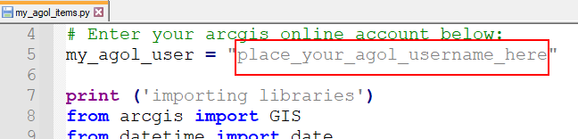

# my_agol
Simple Python script downloads a list of your ArcGIS Online content into a spreadsheet (my_agol_items.xlsx). Credentials for accessing your online content are stored in your ArcGIS Pro installation. If you don't have ArcGIS Pro installed, ask your managers and local tech support.

After downloading my_agol_items.py to a folder on your PC, use a text editor to replace the text below with your ArcGIS Online Member Name.

Download my_agol_items.py to a folder on your PC, then edit 

edit_here.png
